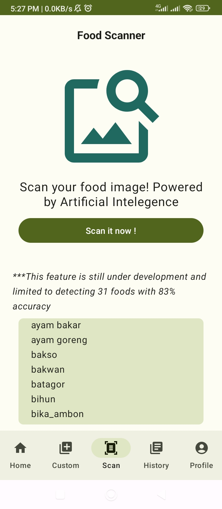
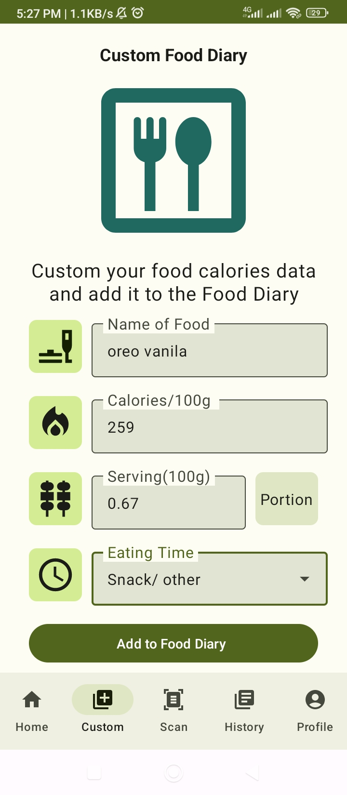
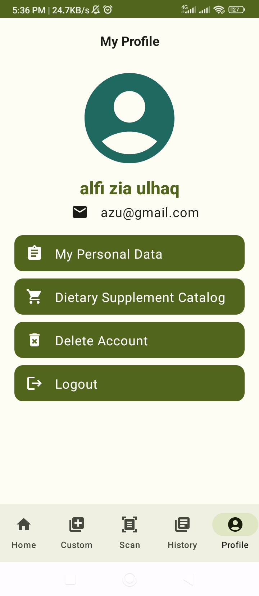
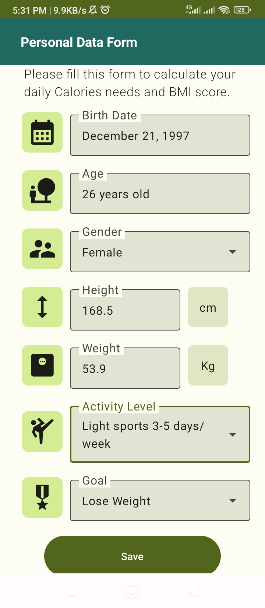

# Nutrizen Android App

Nutrizen is a mobile application developed as a capstone project by our team in the Bangkit Academy program. It empowers users to scan food items for caloric information and track their daily caloric intake.

## Features

- [x] Authentication and Authorization with Java Web Token(JWT)

<p align="center">      </p>

- [x] **Dashboard** : Present your BMI score and today calories goal summary

<p align="center"> </p>

- [x] **Food Scanner** : Scan your food calories by TFLite machine learning model from gallery or camera and add it to the Food Diary. It has limited to detect 31 kind of foods with 83% accuracy

<p align="center">  </p>

- [x] **Custom Food Diary** : Add to your Food Diary by customize food calories input by read it from reference or from nutrition facts on the product label

<p align="center"> </p>

- [x] **Food Diary History** : Search your food diary history with summary by date. Also you can delete the history item if there are something wrong

<p align="center">  </p>

- [x] **Profile Menu** : Present your profile, personal data result, delete account option, and logout from session. You can also re-assign personal data form and dashboard information to be updated automatically 

<p align="center">   </p>

- **Next feature** : Dietary supplement catalog

<p align="center"> </p>

## Demo

<video width="300" src="https://github.com/Nutrizen-Capstone/Nutrizen-Android/assets/90314126/78daefd6-c690-483b-ad36-f5e2080b91f5"></video>


## App Flow

<p align="center"> </p>

- For plan of database, app flow and API documentation detail, see on https://drive.google.com/file/d/1sHGNuTMV6_EwGc0cAsiSvqq2TKX39m69/view?usp=drive_link


## Tech Stack

- **Language**: Kotlin
- **Libraries**: Jetpack compose, Retrofit, Navigation, Kotlin Coroutines, Livedata, Coil, etc.
- **Machine Learning Model Deployment**: TensorFlow Lite (TFLite)

## System Requirements

To run the Nutrizen Android app, ensure that your device meets the following requirements:

- Android 9 (Pie)/ min SDK 28 or newer
- Download Nutrizen_v1.APK on https://drive.google.com/file/d/1UXmeg0aoEuO3W3VWa_frt1LGsatJsq2Q/view?usp=drive_link

## How to Build and Run

1. Clone this repository:

   ```bash
   git clone https://github.com/Nutrizen-Capstone/Nutrizen-Android.git
   ```

2. Open the project in Android Studio.

3. Build and run the project on your Android device or emulator.

## Contributing

We welcome contributions from the community! If you find a bug or want to contribute to this project, please open an issue or submit a pull request.

---

**Nutrizen Android App** was created by CH2-PS076 for the Nutrizen.capstone project. Thank you for using Nutrizen!
```
